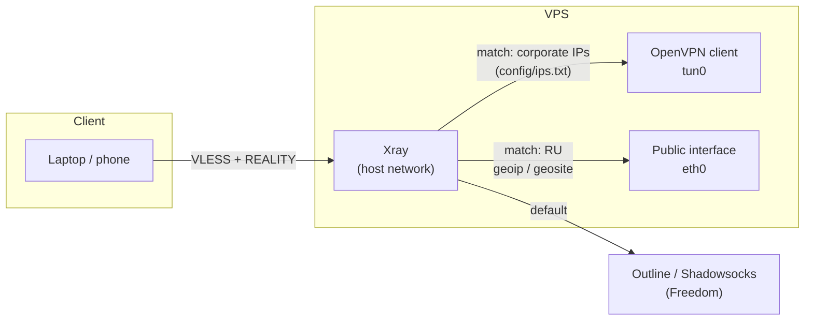
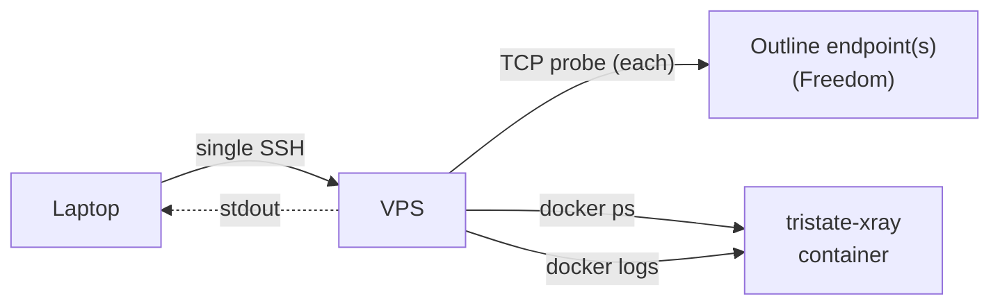
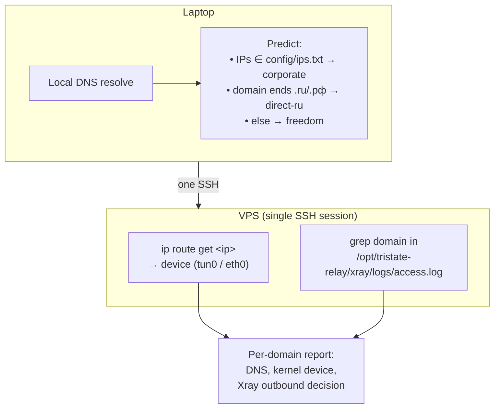

# Tri-State Split-Tunnel Relay Node

## On this page

1. [Quickstart](#quickstart)
2. [Definition](#definition)
3. [Data flow](#data-flow)
4. [Requirements](#requirements)
5. [Repository layout](#repository-layout)
6. [Environment file and `just`](#environment-file-and-just)
7. [How to](#how-to)
   - [Provision a new VPS](#provision-a-new-vps)
   - [Provisioning options](#provisioning-options)
   - [After provisioning](#after-provisioning)
   - [Manage inbounds and clients](#manage-inbounds-and-clients)
   - [Reprovision an existing node](#reprovision-an-existing-node)
   - [Operational checks](#operational-checks)
   - [Routing trace and diagnose](#routing-trace-and-diagnose)
   - [Common failure modes](#common-failure-modes)
   - [Security notes](#security-notes)
   - [Validation](#validation)

---

## Quickstart

Assumes `just`, `docker`, `ssh`, `scp`, `python3` are already installed on your laptop, the VPS is reachable over SSH with a non-root user that has **passwordless sudo**, and `secrets/corporate.ovpn` + `secrets/corporate.auth` are already in place.

### Step 0 — Credentials checklist

Before doing anything, confirm each item. Provisioning aborts in preflight if any are wrong.

| Required | Source | Where it goes |
|---|---|---|
| VPS IP or hostname | your VPS provider | `TRISTATE_HOST` in `.env` |
| SSH username on VPS | your provider / cloud-init | `TRISTATE_SSH_USER` in `.env` |
| SSH port | default `22` unless changed | `TRISTATE_SSH_PORT` in `.env` |
| SSH private key path | `~/.ssh/id_ed25519` or similar | `TRISTATE_SSH_IDENTITY` in `.env` |
| Passwordless sudo on VPS | `sudo visudo` → `youruser ALL=(ALL) NOPASSWD:ALL` | enforced by preflight |
| Corporate `.ovpn` | your corp IT | `secrets/corporate.ovpn` → `TRISTATE_CORP_OVPN` |
| Corporate auth (user/pass, two lines) | your corp IT | `secrets/corporate.auth` → `TRISTATE_AUTH_FILE` |
| Outline `ss://`/`ssconf://` URI(s) | Freedom Outline server admin | `TRISTATE_OUTLINE_URIS` in `.env` |

Verify everything from this repo root:

```bash
[[ -f secrets/corporate.ovpn ]] && echo "ovpn ok"   || echo "MISSING secrets/corporate.ovpn"
[[ -f secrets/corporate.auth ]] && echo "auth ok"   || echo "MISSING secrets/corporate.auth"
[[ -f .env ]]                   && echo "env ok"    || echo "MISSING .env (run: cp .env.example .env)"
```

Then verify the VPS itself:

```bash
ssh -i <your-key> <user>@<host> 'sudo -n true && echo PASSWORDLESS_SUDO_OK'
```

If that prints `PASSWORDLESS_SUDO_OK`, you are ready.

### Step 1 — Create `.env`

```bash
cp .env.example .env
```

Edit `.env` and set exactly these keys (the rest of the defaults are fine):

```env
TRISTATE_HOST=203.0.113.10
TRISTATE_SSH_USER=ubuntu
TRISTATE_SSH_PORT=22
TRISTATE_SSH_IDENTITY=/Users/you/.ssh/id_ed25519
TRISTATE_CORP_OVPN=./secrets/corporate.ovpn
TRISTATE_AUTH_FILE=./secrets/corporate.auth
TRISTATE_OUTLINE_URIS=ss://BASE64CREDS@freedom.example:18066/?outline=1
TRISTATE_CLIENT_NAME=laptop
```

`TRISTATE_CLIENT_NAME=laptop` is what guarantees you get **at least one inbound credential** generated at the end of provisioning (the bootstrap client).

`TRISTATE_OUTLINE_URIS` accepts one or more comma-separated `ss://...` or
`ssconf://...` (Outline dynamic access key) URIs. `ssconf://` URIs are
resolved over HTTPS at provision time. Two or more endpoints are load-balanced
by Xray's routing balancer (`random` strategy) instead of a single fixed
outbound.

### Step 2 — Run provisioning

```bash
just provision
```

What it does (all on the remote VPS, driven from your laptop):

1. Preflight: verifies SSH, passwordless sudo, and that UFW won't lock you out.
2. Uploads helpers, routes, `.ovpn`, and auth file to a temp staging dir.
3. Installs Docker, OpenVPN, UFW, jq, python3 on the VPS.
4. Disables IPv6, sets UFW to default-deny incoming, opens only SSH + `443/tcp`.
5. Rewrites the `.ovpn` for split-tunnel, starts `openvpn-client@corporate`, waits for `tun0`, and verifies at least one corporate route from `config/ips.txt` is installed on `tun0`.
6. Generates (or reuses) the REALITY keypair and a `short_id`.
7. Renders `config/xray_config.template.json` with your clients + keys + Outline + corp IPs.
8. Validates the rendered Xray config remotely, downloads Loyalsoldier `geoip.dat` / `geosite.dat` into `${INSTALL_DIR}/xray/assets/`, installs the **daily geo refresh** systemd timer, and starts the container.
9. Writes `state/<host>/{node.json,clients.json,connection.txt}` locally.
10. Prints the bootstrap VLESS URI.

### Step 3 — Get the inbound credential (VLESS URI)

Provisioning already prints it. Re-fetch anytime:

```bash
just connection
```

Or for the named client directly:

```bash
just manage-uri laptop
```

Paste the `vless://…` URI into your client (v2rayN, Streisand, Hiddify, NekoBox, etc.). That is your one guaranteed working inbound credential.

### Step 4 — Add more clients (optional)

Every call updates local state, re-renders config, redeploys Xray, and prints the new URI:

```bash
just manage-add phone
just manage-add work-laptop
just manage-list
```

### What to do when Step 2 fails

| Symptom | Meaning | Fix |
|---|---|---|
| `Cannot SSH to USER@HOST:PORT` | key, user, host, or port wrong | fix the `TRISTATE_*` value, retry |
| `Remote user 'X' needs passwordless sudo` | sudo asks for a password | `sudo visudo` on VPS, add NOPASSWD line |
| `Warning: active SSH connection is on port N but --ssh-port is M` | mismatch between real SSH port and configured one | align `TRISTATE_SSH_PORT` with the actual port |
| `OpenVPN did not bring up tun0 within 30s` | bad auth, unreachable VPN server, or `.ovpn` issue | `ssh <vps> 'journalctl -u openvpn-client@corporate -n 100'` |
| `none of the corporate routes from ips.txt are installed via tun0` | VPN came up but pushed no usable routes | inspect `ip route show dev tun0` on the VPS; verify `config/ips.txt` matches what the VPN actually reaches |
| `Bootstrap did not return a JSON payload` | remote script died before emitting the sentinel | the raw remote output is printed above the error; fix that root cause first |

---

## Definition

This repository provisions and manages a VPS that accepts a single **VLESS + REALITY** inbound and splits traffic into three outbound paths:

| Path | Mechanism | Exit |
|------|-----------|------|
| Corporate | `direct` in Xray; kernel routes using host routes from OpenVPN on `tun0` | Corporate network via OpenVPN |
| Russian domestic | `direct`; matches `geoip:ru` and many `geosite:*` / `domain:` rules (see [config/xray_config.template.json](config/xray_config.template.json)), resolved using **Loyalsoldier** [v2ray-rules-dat](https://github.com/Loyalsoldier/v2ray-rules-dat) `geoip.dat` / `geosite.dat` on the VPS | VPS native public interface |
| Everything else | Shadowsocks outbound(s) to the configured Outline node(s), balanced by Xray's routing balancer when more than one is configured | Freedom Outline relay |

**Control model:** config-as-code. Local scripts under `scripts/` render config, upload assets, and keep state under `state/<host>/`. Run CLI examples from the **repository root** so paths like `./scripts/...` and `config/...` resolve correctly.

---

## Data flow



### Geo databases and refresh (architecture)

Xray does not embed routing lists in `config.json`. It loads binary **`geoip.dat`** and **`geosite.dat`** from the asset directory (`XRAY_LOCATION_ASSET`, mounted read-only into the container). This stack uses the **Loyalsoldier** builds of those files so tags like `geosite:category-ru`, `geosite:category-bank-ru`, and `geoip:ru` resolve consistently with the upstream project.


- **On every deploy** (`remote_apply_node.sh deploy-config`, invoked by provision and `manage_inbound.sh`): assets are downloaded into `${INSTALL_DIR}/xray/assets/`, Docker Compose is applied, and Xray is restarted.
- **Between deploys**: **`tristate-xray-geo-update.timer`** runs **`${INSTALL_DIR}/xray/update-geo-assets.sh`** once per day (with a randomized delay). The script re-downloads both files, replaces them only if the content changed, and restarts the Xray container when an update was applied.

**Why `direct` can mean two different exits**

- Xray runs with host networking; the kernel picks the interface for each `direct` packet.
- For corporate destinations, routes from [config/ips.txt](config/ips.txt) steer traffic to `tun0` once OpenVPN is up.
- OpenVPN is forced into split-tunnel mode (`route-nopull` and pull-filter guards) so it does not take over the default route or break SSH.

Routing order inside Xray matches destinations in this order:

1. Corporate IPs from [config/ips.txt](config/ips.txt) → `direct`
2. Russian domestic: the `domain` list in the template (including `geosite:…` and `domain:…` entries) and the separate `geoip:ru` rule → `direct`
3. Everything else → `ss-balancer` (Outline; balances across `ss-<name>` outbounds, one per configured URI)

Editing [config/xray_config.template.json](config/xray_config.template.json) changes which names match before IP routing; the **`.dat`** files must contain the referenced `geosite:` / `geoip:` tags (Loyalsoldier’s lists include the `category-*-ru` and vendor lists used there).

---

## Requirements

### On your laptop

- `bash`, `ssh`, `scp`, `python3`
- `curl` (required for `provision_remote.sh --dry-run` when it runs local `xray run -test` with the same Loyalsoldier assets as production)
- SSH access to the target VPS
- [`just`](https://github.com/casey/just) (optional): command runner for recipes that read [.env.example](.env.example)

### On the target VPS

- Ubuntu 22.04 or 24.04
- A public IP address
- `sudo` for the SSH user if you do not connect as `root`
- Outbound HTTPS to fetch `geoip.dat` / `geosite.dat` (GitHub releases); `curl` is installed during bootstrap alongside Docker and the rest of the stack

### Inputs before provisioning

- A corporate `.ovpn` file
- Companion files referenced by that `.ovpn` (`ca`, `cert`, `key`, `tls-auth`, `tls-crypt`, or `auth-user-pass` files)
- Optional two-line auth file if the VPN requires username and password
- One or more Outline URI(s) for the Freedom node(s)

**Notes**

- Relative files referenced by the `.ovpn` are auto-discovered and uploaded.
- If the `.ovpn` references `auth-user-pass somefile`, that file is uploaded and preserved.
- If you pass `--auth-file`, that file is authoritative for deployment.

---

## Repository layout

```text
.
├── README.md
├── justfile                     # command runner (just provision, just manage-list, …)
├── .env.example                 # template for TRISTATE_* variables; copy to .env (gitignored)
├── .gitignore
├── config/
│   ├── ips.txt
│   ├── corporate_domains.txt
│   └── xray_config.template.json
├── scripts/
│   ├── provision_remote.sh      # run from repo root: ./scripts/provision_remote.sh
│   ├── manage_inbound.sh
│   ├── remote_apply_node.sh     # also uploaded to the VPS during provision / deploy
│   ├── diagnose_relay.sh        # one-shot read-only health check of the VPS
│   ├── trace_routing.sh         # predicts + verifies which path each domain takes
│   └── tristate_state_dir.sh    # used by justfile to resolve state dir from .env
├── secrets/                     # optional: keep local .ovpn / .auth here (do not commit)
├── state/                       # generated per host (default: ./state)
└── ...
```

| Artifact | Role |
|----------|------|
| [scripts/provision_remote.sh](scripts/provision_remote.sh) | Local entry point: uploads assets, bootstraps the VPS, renders config, deploys Xray, writes local state |
| [scripts/remote_apply_node.sh](scripts/remote_apply_node.sh) | Remote helper: packages, UFW, OpenVPN, REALITY keys, Loyalsoldier geo assets, systemd geo-update timer, Xray validation, containers |
| [scripts/manage_inbound.sh](scripts/manage_inbound.sh) | Add/remove/rotate VLESS clients; optional inbound port change |
| [scripts/diagnose_relay.sh](scripts/diagnose_relay.sh) | Read-only health check: Outline reachability, Xray container state, recent logs |
| [scripts/trace_routing.sh](scripts/trace_routing.sh) | Per-domain routing trace: local prediction + kernel route + Xray access-log grep |
| [config/xray_config.template.json](config/xray_config.template.json) | Authoritative Xray template (REALITY inbound, tri-state routing, logging, stats) |
| [config/ips.txt](config/ips.txt) | Corporate route list for OpenVPN and Xray corporate matching |
| [config/corporate_domains.txt](config/corporate_domains.txt) | Corporate-domain match list; rule fires before RU/default, so listed hosts exit via `tun0` even if their IPs change |
| [justfile](justfile) | Wraps scripts with `just`; loads `.env` via `set dotenv-load` |
| [.env.example](.env.example) | All `TRISTATE_*` settings (host, SSH, paths, Outline URI(s), REALITY, state paths) |
| `secrets/` | Placeholder for local OpenVPN credentials (paths you pass to `--corp-ovpn` / `--auth-file`) |
| `state/<host>/node.json` | Generated node metadata |
| `state/<host>/clients.json` | Generated client list |
| `state/<host>/connection.txt` | Bootstrap client VLESS URI |

---

## Environment file and `just`

1. Copy the template and edit secrets (never commit `.env`; it is listed in [.gitignore](.gitignore)):

```bash
cp .env.example .env
```

2. Set at least `TRISTATE_HOST`, `TRISTATE_CORP_OVPN`, and `TRISTATE_OUTLINE_URIS` before `just provision`. See [.env.example](.env.example) for every variable.

3. Run recipes from the repository root (`just` loads `.env` next to the [justfile](justfile)):

| Recipe | Meaning |
|--------|---------|
| `just provision` | Same flags as [scripts/provision_remote.sh](scripts/provision_remote.sh), driven by `.env` |
| `just manage-list` | List VLESS clients for `TRISTATE_STATE_ROOT/TRISTATE_HOST` (or `TRISTATE_STATE_DIR`) |
| `just manage-add NAME` | Add a client |
| `just manage-remove NAME` | Remove a client |
| `just manage-rotate NAME` | Rotate client UUID |
| `just manage-uri NAME` | Print client URI |
| `just manage-set-port PORT` | Change inbound port |
| `just connection` | Print `connection.txt` for the current host state dir |
| `just diagnose` | Read-only relay health check (see [Routing trace and diagnose](#routing-trace-and-diagnose)) |
| `just trace DOMAIN…` | Trace routing for one or more domains |
| `just trace-sample` | Trace a fixed sample covering corporate, RU and default paths |
| `just validate` | `bash -n` on shell entrypoints |

```bash
just --list
just provision
just manage-list
just connection
```

You can still call `./scripts/provision_remote.sh` and `./scripts/manage_inbound.sh` with explicit flags; the scripts do not read `.env` themselves.

---

## How to

### Provision a new VPS

Prefer [Environment file and `just`](#environment-file-and-just) (`just provision` with `.env`) for a single place to store host and credentials.

Basic example:

```bash
./scripts/provision_remote.sh \
  --host YOUR_VPS_IP \
  --user root \
  --corp-ovpn /path/to/corporate.ovpn \
  --outline-uri 'ss://Y2hhY2hhMjAtaWV0Zi1wb2x5MTMwNTpURlBvZzdTT1lZaTZDRjUwNmtnc004@95.164.22.5:18066/?outline=1'
```

`--outline-uri` is repeatable (or use `--outline-uris-csv 'a,b'`) to configure
multiple Outline endpoints, balanced by Xray at runtime. Both `ss://` and
`ssconf://` (Outline dynamic access key, resolved over HTTPS) schemes are
accepted:

```bash
./scripts/provision_remote.sh \
  --host YOUR_VPS_IP \
  --user root \
  --corp-ovpn /path/to/corporate.ovpn \
  --outline-uri 'ss://Y2hhY2hhMjAtaWV0Zi1wb2x5MTMwNTpURlBvZzdTT1lZaTZDRjUwNmtnc004@95.164.22.5:18066/?outline=1' \
  --outline-uri 'ssconf://storage.googleapis.com/bucket/key.yaml'
```

With an explicit auth file:

```bash
./scripts/provision_remote.sh \
  --host YOUR_VPS_IP \
  --user root \
  --corp-ovpn /path/to/corporate.ovpn \
  --auth-file /path/to/corporate.auth \
  --outline-uri 'ss://Y2hhY2hhMjAtaWV0Zi1wb2x5MTMwNTpURlBvZzdTT1lZaTZDRjUwNmtnc004@95.164.22.5:18066/?outline=1'
```

Example using files under `secrets/`:

```bash
./scripts/provision_remote.sh \
  --host YOUR_VPS_IP \
  --user root \
  --corp-ovpn ./secrets/corporate.ovpn \
  --auth-file ./secrets/corporate.auth \
  --outline-uri 'ss://...'
```

Provisioning steps:

1. Uploads repo helpers, `config/ips.txt`, the `.ovpn`, and referenced OpenVPN files.
2. Installs `docker`, `docker compose`, `openvpn`, `ufw`, and support packages.
3. Enables IPv4 forwarding.
4. Configures UFW for SSH and the inbound listen port.
5. Rewrites OpenVPN for split-tunnel with:

```text
pull-filter ignore "redirect-gateway"
pull-filter ignore "dhcp-option DNS"
pull-filter ignore "block-outside-dns"
route-nopull
```

6. Appends corporate routes from [config/ips.txt](config/ips.txt).
7. Starts `openvpn-client@corporate`.
8. Generates or reuses REALITY keys.
9. Renders and validates the Xray config.
10. Starts Xray in Docker with host networking.
11. Writes local state under `state/<host>/`.
12. Prints the bootstrap VLESS URI.

### Provisioning options

Important flags:

- `--host`: VPS IP or hostname
- `--user`: SSH user, default `root`
- `--ssh-port`: SSH port, default `22`
- `--ssh-identity`: Optional SSH private key path
- `--corp-ovpn`: Path to the corporate OpenVPN config
- `--auth-file`: Optional two-line username/password file
- `--outline-uri`: Outline/Shadowsocks URI (`ss://` or `ssconf://`); repeatable, at least one required
- `--outline-uris` / `--outline-uris-csv`: Comma-separated list of the same, as an alternative to repeating `--outline-uri`
- `--listen-port`: Xray inbound port, default `443`
- `--server-name`: REALITY SNI value, default `yandex.ru`
- `--reality-dest`: REALITY destination, default `yandex.ru:443`
- `--client-name`: Name for the bootstrap client, default `laptop`
- `--install-dir`: Remote install directory, default `/opt/tristate-relay`
- `--state-root`: Local state directory, default `./state`

### After provisioning

Local state:

```text
state/<host>/
```

Important files:

- `node.json`: Node metadata, REALITY keys, Outline settings, host, listen port
- `clients.json`: Current VLESS clients
- `connection.txt`: VLESS URI for the bootstrap client

```bash
cat state/YOUR_VPS_IP/connection.txt
```

### Manage inbounds and clients

List clients:

```bash
./scripts/manage_inbound.sh --state-dir ./state/YOUR_VPS_IP list
```

Add a client:

```bash
./scripts/manage_inbound.sh --state-dir ./state/YOUR_VPS_IP add-client work-laptop
```

Remove a client:

```bash
./scripts/manage_inbound.sh --state-dir ./state/YOUR_VPS_IP remove-client work-laptop
```

Rotate a client UUID:

```bash
./scripts/manage_inbound.sh --state-dir ./state/YOUR_VPS_IP rotate-client work-laptop
```

Print a client URI:

```bash
./scripts/manage_inbound.sh --state-dir ./state/YOUR_VPS_IP print-uri work-laptop
```

Change the inbound listen port:

```bash
./scripts/manage_inbound.sh --state-dir ./state/YOUR_VPS_IP set-port 8443
```

Behavior: `scripts/manage_inbound.sh` updates local state, re-renders `rendered-config.json`, uploads to the VPS, validates remotely, and runs `remote_apply_node.sh deploy-config` (refreshes geo `.dat` files if needed, reapplies Compose, ensures the geo-update timer exists, restarts Xray).

### Reprovision an existing node

You can rerun [scripts/provision_remote.sh](scripts/provision_remote.sh) on the same host.

- Preserves `clients.json`, REALITY `short_id`, and REALITY keypair on the VPS
- Refreshes node metadata locally
- Redeploys OpenVPN and Xray

Useful when rebuilding packages, changing the Outline URI, REALITY destination/SNI, or OpenVPN input and route list.

### Operational checks

Xray container:

```bash
ssh root@YOUR_VPS_IP 'docker ps --filter name=tristate-xray'
```

Xray logs:

```bash
ssh root@YOUR_VPS_IP 'docker logs --tail 100 tristate-xray'
```

OpenVPN:

```bash
ssh root@YOUR_VPS_IP 'systemctl --no-pager --full status openvpn-client@corporate'
```

Routes:

```bash
ssh root@YOUR_VPS_IP 'ip route show'
```

UFW:

```bash
ssh root@YOUR_VPS_IP 'ufw status verbose'
```

Install directory:

```bash
ssh root@YOUR_VPS_IP 'sudo ls -R /opt/tristate-relay'
```

Loyalsoldier geo refresh timer (daily):

```bash
ssh root@YOUR_VPS_IP 'systemctl status tristate-xray-geo-update.timer --no-pager'
ssh root@YOUR_VPS_IP 'systemctl list-timers | grep tristate-xray-geo || true'
```

Manual geo update (same script the timer runs):

```bash
ssh root@YOUR_VPS_IP 'sudo /opt/tristate-relay/xray/update-geo-assets.sh'
```

Use your real `${INSTALL_DIR}` from `state/<host>/node.json` if it is not `/opt/tristate-relay`.

### Routing trace and diagnose

Two recipes cover post-deploy correctness checks.

#### `just diagnose`

Read-only triage of the relay itself. Checks TCP reachability from the VPS to each configured Outline Shadowsocks endpoint, the Xray container state, and tails the container stderr for recent errors. Use when the client connects but traffic does not flow.



#### `just trace <domain...>` and `just trace-sample`

Given one or more domains, predicts and verifies which of the three paths each destination takes. `trace-sample` uses a fixed set covering all three classes.



**What each layer proves**

| Layer | Authority | Why it matters |
|---|---|---|
| Local prediction | Deterministic against `config/ips.txt` + TLD heuristic | Catches missing routes before touching the VPS |
| `ip route get` on VPS | The Linux kernel's answer | Confirms OpenVPN installed the route and `tun0` is reachable |
| Xray `access.log` grep | Xray's actual routing decision | The only place that distinguishes `direct` (RU/corp) from the `ss-balancer` path because both traverse `eth0` |

**Verdict mapping**

| Kernel device | Xray outbound in access log | Meaning |
|---|---|---|
| `tun0` | `direct` | Corporate destination, going through the OpenVPN tunnel |
| `eth0` | `direct` | RU match, exiting on the VPS's native Russian public IP |
| `eth0` | `ss-<endpoint-name>` (via `ss-balancer`) | Default path, tunnelled to one of the Freedom Outline nodes |

**Flags**

- `TRISTATE_NO_REMOTE=1 just trace <domain...>` — skip the VPS hop (prediction only).
- `TRISTATE_SSH_IDENTITY` is reused from `.env` as for other recipes.

Everything runs inside one SSH session so sshd `MaxStartups` rate-limits do not fire even with many domains.

### Common failure modes

**SSH works, but corporate traffic does not**

- Confirm `openvpn-client@corporate` is active
- Confirm [config/ips.txt](config/ips.txt) lists real corporate destinations
- Confirm required auth files were supplied if the `.ovpn` needs them

**SSH drops after VPN startup**

- Should not occur with injected split-tunnel guards; inspect the source `.ovpn` for unusual routes or scripts

**Global traffic is not using Freedom**

- Check `state/<host>/node.json` and the rendered Xray config
- Check Xray logs for outbound or DNS errors

**Russian destinations do not stay on the native Russian IP**

- Confirm the hostname is covered by the `domain` / `geosite` rules in [config/xray_config.template.json](config/xray_config.template.json) or by `geoip:ru` after resolution, and that `${INSTALL_DIR}/xray/assets/*.dat` are present and recent (deploy and the daily timer both refresh them)
- Confirm no corporate route in [config/ips.txt](config/ips.txt) overrides that traffic

**Reprovision and clients**

- Existing clients should remain; compare `state/<host>/clients.json` before and after if needed

### Security notes

- `.env` holds host, Outline URI, and paths to VPN material; keep it private and never commit it.
- `state/<host>/node.json` and `clients.json` are sensitive.
- Auth files may contain VPN credentials.
- Treat this repo and `state/` as operational secrets: restrict filesystem access, do not commit `state/`, avoid leaking client URIs.

### Validation

```bash
just validate
```

Or manually:

```bash
bash -n scripts/provision_remote.sh
bash -n scripts/remote_apply_node.sh
bash -n scripts/manage_inbound.sh
bash -n scripts/tristate_state_dir.sh
```

Full template validation is exercised by a real provision or the render path embedded in the scripts.
