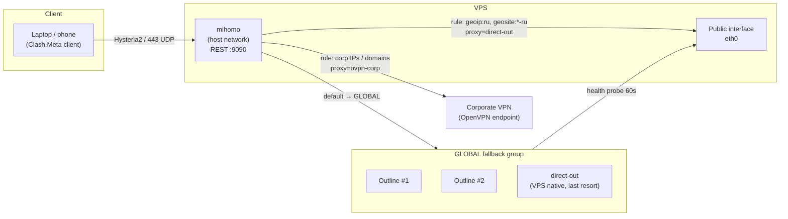
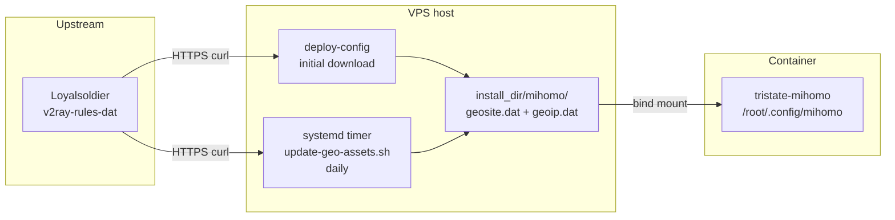
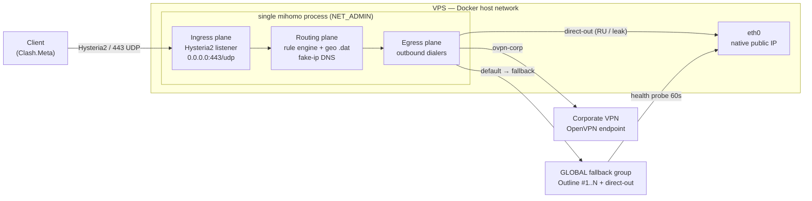
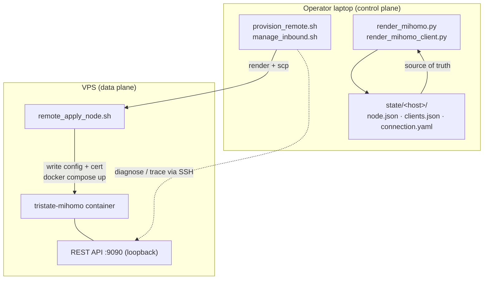
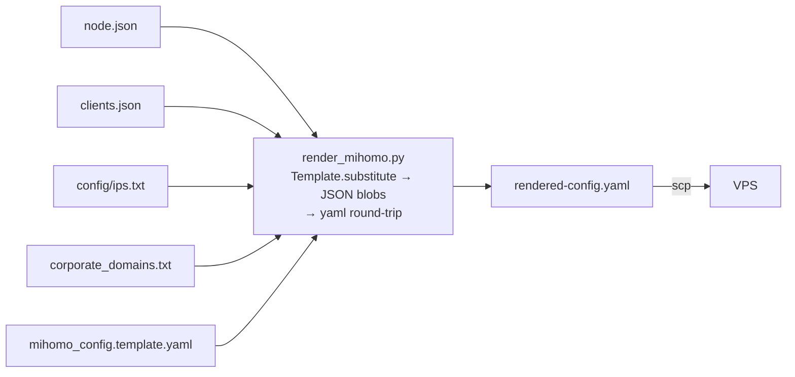
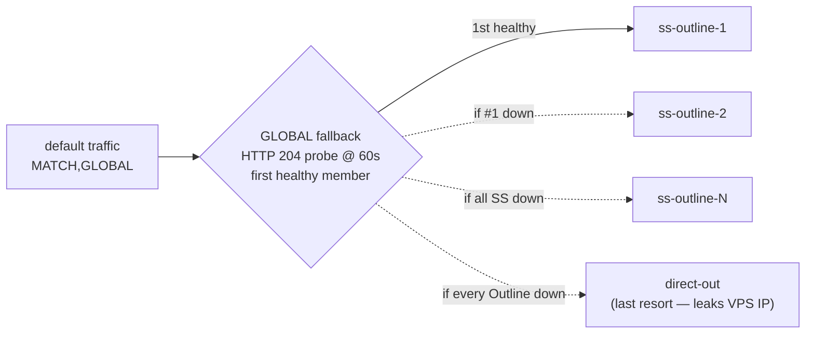
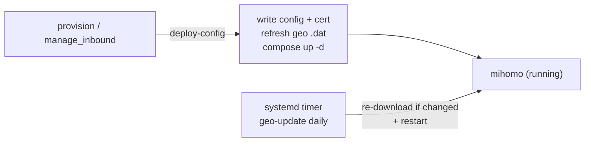
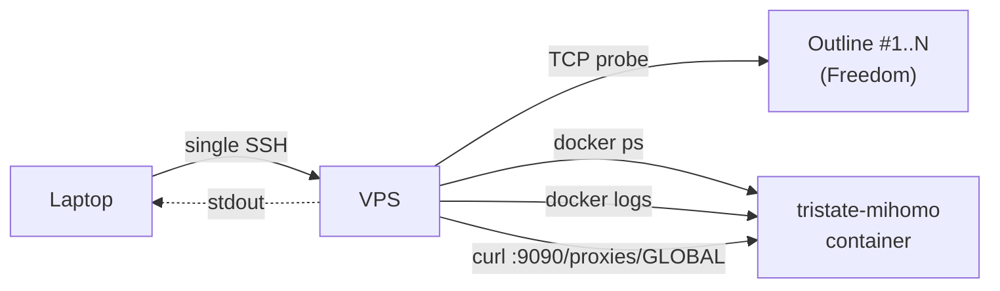
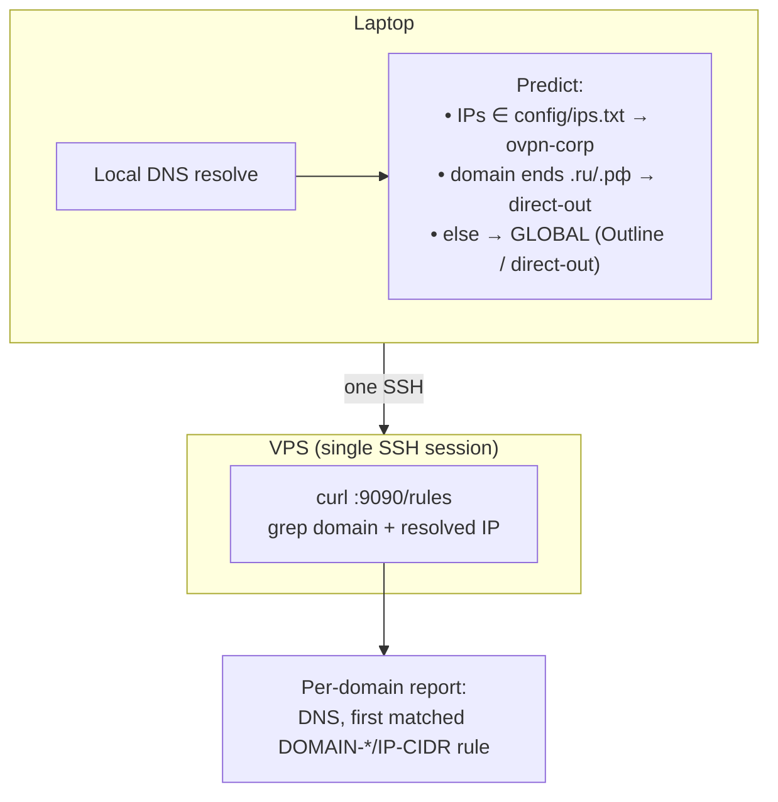

# Tri-State Split-Tunnel Relay Node

## On this page

1. [Quickstart](#quickstart)
2. [Definition](#definition)
3. [Data flow](#data-flow)
4. [System design](#system-design)
5. [Requirements](#requirements)
6. [Repository layout](#repository-layout)
7. [Environment file and `just`](#environment-file-and-just)
8. [How to](#how-to)
   - [Provision a new VPS](#provision-a-new-vps)
   - [Provisioning options](#provisioning-options)
   - [After provisioning](#after-provisioning)
   - [Manage inbounds and clients](#manage-inbounds-and-clients)
   - [Reprovision an existing node](#reprovision-an-existing-node)
   - [Operational checks](#operational-checks)
   - [Routing trace and diagnose](#routing-trace-and-diagnose)
   - [Migration notes](#migration-notes)
   - [Common failure modes](#common-failure-modes)
   - [Security notes](#security-notes)
   - [Validation](#validation)

---

## Quickstart

Assumes `just`, `docker`, `ssh`, `scp`, `python3` are already installed on your laptop, the VPS is reachable over SSH with a non-root user that has **passwordless sudo**, and `secrets/corporate.ovpn` + `secrets/corporate.auth` are already in place.

### Step 0 — Credentials checklist

Before doing anything, confirm each item. Provisioning aborts in preflight if any are wrong.

| Required | Source | Where it goes |
|---|---|---|
| VPS IP or hostname | your VPS provider | `TRISTATE_HOST` in `.env` |
| SSH username on VPS | your provider / cloud-init | `TRISTATE_SSH_USER` in `.env` |
| SSH port | default `22` unless changed | `TRISTATE_SSH_PORT` in `.env` |
| SSH private key path | `~/.ssh/id_ed25519` or similar | `TRISTATE_SSH_IDENTITY` in `.env` |
| Passwordless sudo on VPS | `sudo visudo` → `youruser ALL=(ALL) NOPASSWD:ALL` | enforced by preflight |
| Corporate `.ovpn` | your corp IT | `secrets/corporate.ovpn` → `TRISTATE_CORP_OVPN` |
| Corporate auth (user/pass, two lines) | your corp IT | `secrets/corporate.auth` → `TRISTATE_AUTH_FILE` |
| ≥1 Outline `ss://` URI (two or more recommended for failover) | Freedom Outline server admin(s) | `TRISTATE_OUTLINE_URIS` in `.env` (comma-separated) |

Verify everything from this repo root:

```bash
[[ -f secrets/corporate.ovpn ]] && echo "ovpn ok"   || echo "MISSING secrets/corporate.ovpn"
[[ -f secrets/corporate.auth ]] && echo "auth ok"   || echo "MISSING secrets/corporate.auth"
[[ -f .env ]]                   && echo "env ok"    || echo "MISSING .env (run: cp .env.example .env)"
```

Then verify the VPS itself:

```bash
ssh -i <your-key> <user>@<host> 'sudo -n true && echo PASSWORDLESS_SUDO_OK'
```

If that prints `PASSWORDLESS_SUDO_OK`, you are ready.

### Step 1 — Create `.env`

```bash
cp .env.example .env
```

Edit `.env` and set exactly these keys (the rest of the defaults are fine):

```env
TRISTATE_HOST=203.0.113.10
TRISTATE_SSH_USER=ubuntu
TRISTATE_SSH_PORT=22
TRISTATE_SSH_IDENTITY=/Users/you/.ssh/id_ed25519
TRISTATE_CORP_OVPN=./secrets/corporate.ovpn
TRISTATE_AUTH_FILE=./secrets/corporate.auth
TRISTATE_OUTLINE_URIS=ss://BASE64CREDS@freedom1.example:18066/?outline=1,ss://BASE64CREDS@freedom2.example:18066/?outline=1
TRISTATE_CLIENT_NAME=laptop
```

`TRISTATE_CLIENT_NAME=laptop` is what guarantees you get **at least one inbound credential** generated at the end of provisioning (the bootstrap client). The inbound is Hysteria2 on `443/udp`.

### Step 2 — Run provisioning

```bash
just provision
```

What it does (all on the remote VPS, driven from your laptop):

1. Preflight: verifies SSH, passwordless sudo, and that UFW won't lock you out.
2. Uploads helpers, routes, the `.ovpn` + auth file, and the openvpn-corp sidecar build context to a temp staging dir.
3. Installs Docker, UFW, jq, python3, openssl on the VPS and ensures the `tun` device exists (for the sidecar). No host-level OpenVPN client — the tunnel runs inside the sidecar container.
4. Disables IPv6, sets UFW to default-deny incoming, opens only SSH + `443/udp` (Hysteria2 listens on UDP).
5. Builds the **openvpn-corp sidecar** (a real OpenVPN client) from a self-contained config — corporate `.ovpn` with inlined CA/cert/key, the two-line `auth-user-pass` credentials, and the `config/ips.txt` corporate routes — then starts it and waits for the corp tunnel (`tun0`). The sidecar exposes a loopback-only SOCKS5 proxy on `127.0.0.1:1080`.
6. Generates (or reuses) a self-signed certificate for Hysteria2 and records its SHA-256 fingerprint so clients can pin it with `skip-cert-verify: true`.
7. Renders `config/mihomo_config.template.yaml` with your clients + hy2 cert + all Outline endpoints + the `ovpn-corp` SOCKS5 outbound (pointing at the sidecar) + corp IPs.
8. Validates the rendered mihomo config remotely, downloads Loyalsoldier `geoip.dat` / `geosite.dat` into `${INSTALL_DIR}/mihomo/`, installs the **daily geo refresh** systemd timer, and starts the `tristate-mihomo` container (image `metacubex/mihomo:v1.19.25`, `network_mode: host`, `cap_add: [NET_ADMIN]`) alongside the `tristate-openvpn-corp` sidecar.
9. Writes `state/<host>/{node.json,clients.json,connection.yaml}` locally.
10. Prints the bootstrap mihomo client YAML.

### Step 3 — Get the inbound credential (mihomo client YAML)

Provisioning already prints it. Re-fetch anytime:

```bash
just connection
```

Or for the named client directly:

```bash
just manage-config laptop
```

Paste the YAML into any Clash.Meta-compatible client — Clash Verge Rev (macOS/Windows), Hiddify or ClashMi (iOS), Clash for Android. That is your one guaranteed working inbound credential.

### Step 4 — Add more clients (optional)

Every call updates local state, re-renders config, redeploys mihomo, and prints the new YAML:

```bash
just manage-add phone
just manage-add work-laptop
just manage-list
```

### What to do when Step 2 fails

| Symptom | Meaning | Fix |
|---|---|---|
| `Cannot SSH to USER@HOST:PORT` | key, user, host, or port wrong | fix the `TRISTATE_*` value, retry |
| `Remote user 'X' needs passwordless sudo` | sudo asks for a password | `sudo visudo` on VPS, add NOPASSWD line |
| `Warning: active SSH connection is on port N but --ssh-port is M` | mismatch between real SSH port and configured one | align `TRISTATE_SSH_PORT` with the actual port |
| `corporate tunnel did not come up` (deploy-sidecar) | bad VPN auth, unreachable/IP-filtered VPN server, or cipher/`.ovpn` issue | `ssh <vps> 'docker logs --tail 200 tristate-openvpn-corp'` and look for the OpenVPN handshake errors (`AUTH_FAILED`, no TLS reply, etc.) |
| Corp destinations time out but tunnel is up | sidecar `tun0` is up but routes/DNS don't reach the destinations | verify `config/ips.txt` matches what the corporate VPN exposes; `ssh <vps> 'docker exec tristate-openvpn-corp ip route'` and `curl --socks5-hostname 127.0.0.1:1080 https://<corp-host>` from the VPS |
| `Bootstrap did not return a JSON payload` | remote script died before emitting the sentinel | the raw remote output is printed above the error; fix that root cause first |

---

## Definition

This repository provisions and manages a VPS that accepts a single **Hysteria2** inbound (mihomo-based) and splits traffic into three outbound paths:

| Path | Mechanism | Exit |
|------|-----------|------|
| Corporate | mihomo `socks5` outbound `ovpn-corp` → the **openvpn-corp sidecar** (a real OpenVPN client container) which dials the corporate VPN and egresses through its `tun0` | Corporate network via the sidecar's OpenVPN tunnel |
| Russian domestic | mihomo `direct-out` rule; matches `geoip:ru` and many `geosite:*` / `domain:` rules (see [config/mihomo_config.template.yaml](config/mihomo_config.template.yaml)), resolved using **Loyalsoldier** [v2ray-rules-dat](https://github.com/Loyalsoldier/v2ray-rules-dat) `geoip.dat` / `geosite.dat` on the VPS | VPS native public interface |
| Everything else | `GLOBAL` proxy-group of type `fallback`: multiple Shadowsocks (Outline) endpoints + `direct-out`, HTTP health probe (60s) | First healthy Outline endpoint; on total Outline failure, last-resort `direct-out` (leaks VPS IP) |

**Control model:** config-as-code. Local scripts under `scripts/` render config, upload assets, and keep state under `state/<host>/`. Run CLI examples from the **repository root** so paths like `./scripts/...` and `config/...` resolve correctly.

---

## Data flow



### Geo databases and refresh (architecture)

mihomo loads binary **`geoip.dat`** and **`geosite.dat`** from its working directory (`${INSTALL_DIR}/mihomo/`, mounted into the container). This stack uses the **Loyalsoldier** builds of those files so tags like `geosite:category-ru`, `geosite:category-bank-ru`, and `geoip:ru` resolve consistently with the upstream project.



- **On every deploy** (`remote_apply_node.sh deploy-config`, invoked by provision and `manage_inbound.sh`): assets are downloaded into `${INSTALL_DIR}/mihomo/`, Docker Compose is applied, and mihomo is restarted.
- **Between deploys**: **`tristate-mihomo-geo-update.timer`** runs **`${INSTALL_DIR}/mihomo/update-geo-assets.sh`** once per day (with a randomized delay). The script re-downloads both files, replaces them only if the content changed, and restarts the mihomo container when an update was applied.

**Routing inside mihomo**

mihomo runs with `enhanced-mode: fake-ip` (range `198.18.0.0/16`) so domain-form destinations carry a synthetic IP through the kernel and GEOIP/GEOSITE rules still get to inspect the original FQDN. DNS uses Yandex DNS-over-HTTPS for RU traffic and Cloudflare/Google for the rest.

Rule evaluation order:

1. Corporate IPs from [config/ips.txt](config/ips.txt) and corporate domains from [config/corporate_domains.txt](config/corporate_domains.txt) → `ovpn-corp`
2. Russian domestic: the `domain` / `geosite` entries in the template and the `geoip,ru` rule → `direct-out`
3. Everything else → `GLOBAL` (fallback proxy-group: Outline #1, Outline #2, …, then `direct-out`)

Note that `direct-out` here is a mihomo **proxy-group entry**, not a kernel-level escape hatch. It means "send out of the VPS's native interface". The old Xray-era trick of relying on the kernel's `tun0` route for corporate traffic no longer applies — see [Migration notes](#migration-notes).

Editing [config/mihomo_config.template.yaml](config/mihomo_config.template.yaml) changes which names match before IP routing; the **`.dat`** files must contain the referenced `geosite:` / `geoip:` tags (Loyalsoldier's lists include the `category-*-ru` and vendor lists used there).

---

## System design

This section explains *why* the system is shaped the way it is. [Definition](#definition) and [Data flow](#data-flow) cover *what* it does; this covers the architecture and the decisions behind it.

### One engine, three planes

The runtime is **mihomo (Clash.Meta kernel)** in one `network_mode: host` container that owns ingress + routing, plus a small **openvpn-corp sidecar** that owns only the corporate tunnel. mihomo makes every routing decision; for corp-bound traffic its egress is a SOCKS5 hop into the sidecar. The older Xray-based stack ran Xray plus a host-level `openvpn-client@corporate` systemd unit with a kernel `tun0` route — that host-level client is gone; the OpenVPN client now lives in the isolated sidecar instead.

mihomo can't dial OpenVPN itself against this corporate gateway — its `openvpn` outbound requires `tls-crypt` and only supports AES-GCM, while the gateway uses neither (no tls-crypt, BF-CBC). The sidecar runs a real `openvpn` binary, which handles those legacy parameters, and exposes the tunnel to mihomo as a plain SOCKS5 proxy.

| Plane | Responsibility | Surface |
|---|---|---|
| Ingress | Terminate the single Hysteria2 inbound (UDP) | `0.0.0.0:443/udp`, TLS self-signed (mihomo) |
| Routing | Classify each connection into corp / RU / default | rule engine + `.dat` geo data + fake-ip DNS (mihomo) |
| Egress | Dial the chosen outbound | `socks5` → openvpn-corp sidecar, `direct`, or Shadowsocks fallback group |
| Corp tunnel | Hold the OpenVPN session + SOCKS5 egress | `tristate-openvpn-corp` sidecar, `tun0` + `127.0.0.1:1080` |

Keeping the kernel out of the routing decision is still the central design choice: every packet's fate is decided **inside mihomo** by its rule list, not by host routes or iptables. Only the sidecar's isolated network namespace holds the corp `tun0`. The cost is the [migration behavior change](#migration-notes) — host shell sessions no longer reach corp, because only the sidecar holds the corp route now.



### Control plane vs data plane



- **Control plane is your laptop.** All authority lives in `state/<host>/`. Scripts render config locally, push artifacts over SSH/SCP, and never read secrets from the VPS. The scripts themselves are stateless — re-running them re-derives everything from `state/` + inputs.
- **Data plane is the VPS.** It runs only what was pushed to it. [scripts/remote_apply_node.sh](scripts/remote_apply_node.sh) is uploaded and executed remotely; it writes the rendered config, materializes the cert, and (re)starts the container.
- **Config-as-code.** The deployed config is a pure function of `node.json` + `clients.json` + `config/ips.txt` + `config/corporate_domains.txt` + the template. No hand-editing on the box. A reprovision yields the same config.

### Render pipeline

The deployed YAML is never hand-written. It is generated by a tested Python renderer:



[scripts/render_mihomo.py](scripts/render_mihomo.py) substitutes `$LISTEN_PORT`, `$HY2_USERS`, `$PROXIES`, `$GLOBAL_PROXIES`, `$RULES` into [config/mihomo_config.template.yaml](config/mihomo_config.template.yaml), then round-trips through a YAML parser so the output is canonical YAML rather than a JSON-blob splice. Pulling the logic out of bash heredocs makes it unit-testable — see `scripts/tests/`, which assert the listener users, the SS proxies, the fallback group membership, the `ovpn-corp` SOCKS5 outbound, and the full rule ordering.

### Routing model and rule ordering

Rule order is load-bearing — mihomo evaluates top-to-bottom, first match wins. The renderer emits them in this exact precedence:

1. **Loop guard** (`IP-CIDR <outline IPs + VPS self> → direct-out, no-resolve`) — FIRST, so Shadowsocks packets leaving toward an Outline endpoint never re-enter the Hysteria2 inbound and loop.
2. **Corporate** (domains then IP-CIDRs → `ovpn-corp`) — corp wins over RU/default.
3. **Russian domestic** (RU geosites, explicit RU domains, `GEOIP,RU` → `direct-out`).
4. **Default** (`MATCH,GLOBAL`) → the fallback proxy-group.

`enhanced-mode: fake-ip` (range `198.18.0.0/16`) is what makes domain-form destinations routable by GEOIP rules: mihomo hands the client a synthetic IP, keeps the original FQDN, and resolves the real address at egress decision time. This mirrors the old Xray `domainStrategy: IPIfNonMatch` semantic. RU DNS goes to Yandex DoH; everything else to Cloudflare/Google.

### Resilience: the fallback group

The reason for the whole migration. `GLOBAL` is a `fallback` proxy-group, not `select`:



mihomo health-probes each member and routes default traffic through the **first healthy** Outline endpoint. One Outline node dying no longer kills global traffic — mihomo silently shifts to the next. Only when *every* Outline endpoint fails does it fall to `direct-out`, which works but leaks the VPS public IP (last resort, visible as `now: direct-out` in the REST API). The legacy single-Outline stack had no such failover; a midday outage took everything down.

### State model and trust boundaries

| File | Holds | Sensitivity |
|---|---|---|
| `state/<host>/node.json` | hy2 cert+key+fingerprint, OpenVPN reference block (server/port/proto + CA / username / password), full Outline list | **secret** — `chmod 600` |
| `state/<host>/clients.json` | `[{email, password}]` Hysteria2 users | **secret** |
| `state/<host>/connection.yaml` | bootstrap client YAML (hy2 password + cert fp) | **secret** |
| `${INSTALL_DIR}/openvpn-corp/etc/` (on VPS) | `corporate.conf` (inlined `.ovpn`) + `corporate.auth` consumed by the sidecar | **secret** — `chmod 600` root |

Design point: **the rendered mihomo config carries no corporate secrets** — its corp outbound is just `socks5 → 127.0.0.1:1080`. The OpenVPN credentials/certs live only where they are used: in the sidecar's mount (`${INSTALL_DIR}/openvpn-corp/etc/`, root-owned `0600`) on the VPS, and in `state/<host>/node.json` locally for reprovision. Wipe the VPS, reprovision from `state/` + the original `.ovpn`, identical result.

Trust boundaries:
- **REST API (`:9090`) binds loopback only.** No remote control surface; reach it via SSH tunnel for diagnostics.
- **UFW default-deny incoming**, opens only SSH + `443/udp`. IPv6 disabled to avoid leak paths around the v4 rule set.
- **Self-signed Hysteria2 cert**, pinned by clients via SHA-256 fingerprint (`skip-cert-verify: true` + `fingerprint:`). No domain or ACME required — fastest cutover; a domain-based ACME cert is a future swap.

### Deploy / refresh lifecycle



- **Every deploy** (`remote_apply_node.sh deploy-config`, called by provision and by `manage_inbound.sh`) re-downloads Loyalsoldier `geoip.dat`/`geosite.dat` into `${INSTALL_DIR}/mihomo/`, validates the rendered config with `mihomo -t`, and applies Compose.
- **Between deploys**, `tristate-mihomo-geo-update.timer` runs the geo refresh daily (randomized delay), replacing the `.dat` files only on content change and restarting the container when it does. This keeps RU/geosite classification current without an operator round-trip.

### Key design decisions (and trade-offs)

| Decision | Why | Trade-off |
|---|---|---|
| mihomo routing brain + isolated openvpn-corp sidecar, no host OpenVPN | One routing brain; reproducible; corp `tun0` confined to the sidecar netns | Host shells can't reach corp anymore |
| Hysteria2 over UDP/443 | QUIC-based, censorship-resistant, single port | Must open `443/udp` (not tcp) in cloud firewall |
| Self-signed cert + fingerprint pin | No domain needed, instant cutover | Manual fingerprint distribution; no CA revocation |
| `fallback` group + `direct-out` tail | Survives Outline outages | Total Outline failure leaks VPS IP |
| Secrets inlined in `node.json` | Stateless data plane, clean reprovision | `node.json` is highly sensitive (`chmod 600`) |
| Render in Python, not bash heredocs | Unit-testable rule ordering | Extra `python3` + PyYAML dependency on laptop |

---

## Requirements

### On your laptop

- `bash`, `ssh`, `scp`, `python3`
- `curl` (used by `provision_remote.sh --dry-run` when it does a local mihomo config syntax check against the same Loyalsoldier assets as production)
- SSH access to the target VPS
- [`just`](https://github.com/casey/just) (optional): command runner for recipes that read [.env.example](.env.example)

### On the target VPS

- Ubuntu 22.04 or 24.04
- A public IP address
- `sudo` for the SSH user if you do not connect as `root`
- Outbound HTTPS to fetch `geoip.dat` / `geosite.dat` (GitHub releases); `curl` is installed during bootstrap alongside Docker and the rest of the stack
- `443/udp` open in the cloud provider's firewall (mihomo listens on UDP for Hysteria2, not TCP)

### Inputs before provisioning

- A corporate `.ovpn` file (the openvpn-corp sidecar runs it as a real OpenVPN client; CA/cert/key are inlined into the sidecar's `corporate.conf`)
- Companion files referenced by that `.ovpn` (`ca`, `cert`, `key`, `tls-auth`, `tls-crypt`, or `auth-user-pass` files)
- Optional two-line auth file if the VPN requires username and password
- One or more Outline URIs for the Freedom node(s)

**Notes**

- Relative files referenced by the `.ovpn` are inlined into the sidecar's self-contained `corporate.conf`, so the sidecar has no external-file deps on the VPS.
- A bare `auth-user-pass` directive is stripped; the sidecar supplies credentials from the uploaded `corporate.auth` (your `--auth-file`).
- If you pass `--auth-file`, that file is authoritative for deployment.

---

## Repository layout

```text
.
├── README.md
├── justfile                     # command runner (just provision, just manage-list, …)
├── .env.example                 # template for TRISTATE_* variables; copy to .env (gitignored)
├── .gitignore
├── config/
│   ├── ips.txt
│   ├── corporate_domains.txt
│   └── mihomo_config.template.yaml
├── scripts/
│   ├── provision_remote.sh      # run from repo root: ./scripts/provision_remote.sh
│   ├── manage_inbound.sh
│   ├── remote_apply_node.sh     # also uploaded to the VPS during provision / deploy
│   ├── diagnose_relay.sh        # one-shot read-only health check of the VPS
│   ├── trace_routing.sh         # predicts + verifies which path each domain takes
│   ├── tristate_state_dir.sh    # used by justfile to resolve state dir from .env
│   └── tests/                   # python3 -m pytest scripts/tests/
├── secrets/                     # optional: keep local .ovpn / .auth here (do not commit)
├── state/                       # generated per host (default: ./state)
└── ...
```

| Artifact | Role |
|----------|------|
| [scripts/provision_remote.sh](scripts/provision_remote.sh) | Local entry point: uploads assets, bootstraps the VPS, renders mihomo config, deploys mihomo container, writes local state |
| [scripts/remote_apply_node.sh](scripts/remote_apply_node.sh) | Remote helper: packages, UFW, Hysteria2 cert generation, Loyalsoldier geo assets, systemd geo-update timer, mihomo config validation, container |
| [scripts/manage_inbound.sh](scripts/manage_inbound.sh) | Add/remove/rotate Hysteria2 clients (password-based); optional inbound port change |
| [scripts/diagnose_relay.sh](scripts/diagnose_relay.sh) | Read-only health check: Outline reachability, mihomo container state, REST API checks, recent logs |
| [scripts/trace_routing.sh](scripts/trace_routing.sh) | Per-domain routing trace: local prediction + grep over mihomo REST `/rules` dump |
| [config/mihomo_config.template.yaml](config/mihomo_config.template.yaml) | Authoritative mihomo template (Hysteria2 inbound, `ovpn-corp` SOCKS5 outbound, fallback proxy-group, tri-state routing, fake-ip DNS) |
| [config/ips.txt](config/ips.txt) | Corporate route list referenced by the corp routing rule |
| [config/corporate_domains.txt](config/corporate_domains.txt) | Corporate-domain match list; rule fires before RU/default, so listed hosts exit via `ovpn-corp` (the sidecar) even if their IPs change |
| [justfile](justfile) | Wraps scripts with `just`; loads `.env` via `set dotenv-load` |
| [.env.example](.env.example) | All `TRISTATE_*` settings (host, SSH, paths, Outline URIs, state paths) |
| `secrets/` | Placeholder for local OpenVPN credentials (paths you pass to `--corp-ovpn` / `--auth-file`) |
| `state/<host>/node.json` | Generated node metadata (embeds hy2 cert+key, ovpn ca / tls-crypt / credentials, Outline list) |
| `state/<host>/clients.json` | Generated client list `[{email, password}, …]` |
| `state/<host>/connection.yaml` | Bootstrap client mihomo YAML |

---

## Environment file and `just`

1. Copy the template and edit secrets (never commit `.env`; it is listed in [.gitignore](.gitignore)):

```bash
cp .env.example .env
```

2. Set at least `TRISTATE_HOST`, `TRISTATE_CORP_OVPN`, and `TRISTATE_OUTLINE_URIS` before `just provision`. See [.env.example](.env.example) for every variable.

3. Run recipes from the repository root (`just` loads `.env` next to the [justfile](justfile)):

| Recipe | Meaning |
|--------|---------|
| `just provision` | Same flags as [scripts/provision_remote.sh](scripts/provision_remote.sh), driven by `.env` |
| `just provision-check` | Dry-run wrapper — validates `.env`, URIs, ovpn parse, SSH/sudo reachability, renders config locally, optionally runs `mihomo -t`. Safe first-run command; touches nothing on the VPS or in `state/` |
| `just manage-list` | List Hysteria2 clients for `TRISTATE_STATE_ROOT/TRISTATE_HOST` (or `TRISTATE_STATE_DIR`) |
| `just manage-add NAME` | Add a client |
| `just manage-remove NAME` | Remove a client |
| `just manage-rotate NAME` | Rotate client password |
| `just manage-config NAME` | Print client mihomo YAML |
| `just manage-uri NAME` | Deprecated alias for `manage-config` (kept for muscle memory) |
| `just manage-set-port PORT` | Change inbound UDP port |
| `just connection` | Print `connection.yaml` for the current host state dir |
| `just diagnose` | Read-only relay health check (see [Routing trace and diagnose](#routing-trace-and-diagnose)) |
| `just trace DOMAIN…` | Trace routing for one or more domains |
| `just trace-sample` | Trace a fixed sample covering corporate, RU and default paths |
| `just validate` | `bash -n` on shell entrypoints |

```bash
just --list
just provision
just manage-list
just connection
```

You can still call `./scripts/provision_remote.sh` and `./scripts/manage_inbound.sh` with explicit flags; the scripts do not read `.env` themselves.

---

## How to

### Provision a new VPS

Prefer [Environment file and `just`](#environment-file-and-just) (`just provision` with `.env`) for a single place to store host and credentials.

Basic example:

```bash
./scripts/provision_remote.sh \
  --host YOUR_VPS_IP \
  --user root \
  --corp-ovpn /path/to/corporate.ovpn \
  --outline-uris 'ss://Y2hhY2hhMjAtaWV0Zi1wb2x5MTMwNTpURlBvZzdTT1lZaTZDRjUwNmtnc004@95.164.22.5:18066/?outline=1'
```

With an explicit auth file and two Outline endpoints (comma-separated):

```bash
./scripts/provision_remote.sh \
  --host YOUR_VPS_IP \
  --user root \
  --corp-ovpn /path/to/corporate.ovpn \
  --auth-file /path/to/corporate.auth \
  --outline-uris 'ss://...@freedom1.example:18066/?outline=1,ss://...@freedom2.example:18066/?outline=1'
```

Example using files under `secrets/`:

```bash
./scripts/provision_remote.sh \
  --host YOUR_VPS_IP \
  --user root \
  --corp-ovpn ./secrets/corporate.ovpn \
  --auth-file ./secrets/corporate.auth \
  --outline-uris 'ss://...,ss://...'
```

Provisioning steps:

1. Uploads repo helpers, `config/ips.txt`, the `.ovpn` + auth file, and the openvpn-corp sidecar build context.
2. Installs `docker`, `docker compose`, `ufw`, `openssl`, and support packages; ensures the `tun` device exists. (No host-level OpenVPN — the client runs in the sidecar.)
3. Enables IPv4 forwarding.
4. Configures UFW for SSH and the inbound UDP listen port.
5. Builds + starts the `tristate-openvpn-corp` sidecar from a self-contained config (inlined `.ovpn` + auth + `config/ips.txt` routes) and waits for `tun0`; it serves SOCKS5 on `127.0.0.1:1080`. A reference `openvpn_corp` block is also written to `node.json`.
6. Generates or reuses a self-signed Hysteria2 certificate and records its SHA-256 fingerprint.
7. Renders and validates the mihomo config (corp outbound = `socks5 → 127.0.0.1:1080`).
8. Starts mihomo in Docker with host networking (`tristate-mihomo`, `metacubex/mihomo:v1.19.25`, `cap_add: [NET_ADMIN]`) alongside the sidecar.
9. Writes local state under `state/<host>/`.
10. Prints the bootstrap mihomo client YAML.

### Provisioning options

Important flags:

- `--host`: VPS IP or hostname
- `--user`: SSH user, default `root`
- `--ssh-port`: SSH port, default `22`
- `--ssh-identity`: Optional SSH private key path
- `--corp-ovpn`: Path to the corporate OpenVPN config
- `--auth-file`: Optional two-line username/password file
- `--outline-uris`: Required, comma-separated list of Outline/Shadowsocks URIs (one or more)
- `--listen-port`: Hysteria2 inbound UDP port, default `443`
- `--client-name`: Name for the bootstrap client, default `laptop`
- `--install-dir`: Remote install directory, default `/opt/tristate-relay`
- `--state-root`: Local state directory, default `./state`

### After provisioning

Local state:

```text
state/<host>/
```

Important files:

- `node.json`: Node metadata, Hysteria2 cert + key + fingerprint, `openvpn_corp` reference block (server/port/proto, CA, username, password — consumed by the sidecar, not mihomo), `outline: [...]` array, host, listen port
- `clients.json`: Current Hysteria2 clients, `[{email, password}, ...]`
- `connection.yaml`: Bootstrap mihomo client YAML

```bash
cat state/YOUR_VPS_IP/connection.yaml
```

### Manage inbounds and clients

List clients:

```bash
./scripts/manage_inbound.sh --state-dir ./state/YOUR_VPS_IP list
```

Add a client:

```bash
./scripts/manage_inbound.sh --state-dir ./state/YOUR_VPS_IP add-client work-laptop
```

Remove a client:

```bash
./scripts/manage_inbound.sh --state-dir ./state/YOUR_VPS_IP remove-client work-laptop
```

Rotate a client password:

```bash
./scripts/manage_inbound.sh --state-dir ./state/YOUR_VPS_IP rotate-client work-laptop
```

Print a client config:

```bash
./scripts/manage_inbound.sh --state-dir ./state/YOUR_VPS_IP print-config work-laptop
```

`print-uri` is preserved as a deprecated alias for `print-config` and emits the same mihomo YAML.

Change the inbound listen port:

```bash
./scripts/manage_inbound.sh --state-dir ./state/YOUR_VPS_IP set-port 8443
```

Behavior: `scripts/manage_inbound.sh` updates local state, re-renders `rendered-config.yaml`, uploads to the VPS, validates remotely, and runs `remote_apply_node.sh deploy-config` (refreshes geo `.dat` files if needed, reapplies Compose, ensures the geo-update timer exists, restarts mihomo).

### Reprovision an existing node

You can rerun [scripts/provision_remote.sh](scripts/provision_remote.sh) on the same host.

- Preserves `clients.json` and the Hysteria2 cert/key on the VPS
- Refreshes node metadata locally
- Redeploys the mihomo stack

Useful when rebuilding packages, changing the Outline URI list, or updating the OpenVPN input and route list.

### Operational checks

mihomo container:

```bash
ssh root@YOUR_VPS_IP 'docker ps --filter name=tristate-mihomo'
```

mihomo logs:

```bash
ssh root@YOUR_VPS_IP 'docker logs --tail 100 tristate-mihomo'
```

mihomo REST API (control plane on `127.0.0.1:9090`, expose via SSH tunnel):

```bash
# from your laptop:
ssh -L 9090:127.0.0.1:9090 root@YOUR_VPS_IP

# then in another shell:
curl -s http://127.0.0.1:9090/proxies/GLOBAL | jq '{now, all}'
curl -s http://127.0.0.1:9090/rules | jq '.rules[:10]'
curl -s http://127.0.0.1:9090/connections | jq '.connections | length'
```

UFW:

```bash
ssh root@YOUR_VPS_IP 'ufw status verbose'
```

Install directory:

```bash
ssh root@YOUR_VPS_IP 'sudo ls -R /opt/tristate-relay'
```

Loyalsoldier geo refresh timer (daily):

```bash
ssh root@YOUR_VPS_IP 'systemctl status tristate-mihomo-geo-update.timer --no-pager'
ssh root@YOUR_VPS_IP 'systemctl list-timers | grep tristate-mihomo-geo || true'
```

Manual geo update (same script the timer runs):

```bash
ssh root@YOUR_VPS_IP 'sudo /opt/tristate-relay/mihomo/update-geo-assets.sh'
```

Use your real `${INSTALL_DIR}` from `state/<host>/node.json` if it is not `/opt/tristate-relay`.

### Routing trace and diagnose

Two recipes cover post-deploy correctness checks.

#### `just diagnose`

Read-only triage of the relay itself. Checks TCP reachability from the VPS to each Outline Shadowsocks endpoint, the mihomo container state, the REST API health (`/proxies/GLOBAL` selected member, `/rules` count), and tails the container stderr for recent errors. Use when the client connects but traffic does not flow.



#### `just trace <domain...>` and `just trace-sample`

Given one or more domains, predicts and verifies which of the three paths each destination takes. `trace-sample` uses a fixed set covering all three classes.



**What each layer proves**

| Layer | Authority | Why it matters |
|---|---|---|
| Local prediction | Deterministic against `config/ips.txt` + TLD heuristic | Catches missing rules before touching the VPS |
| `curl :9090/rules` on VPS (grep) | mihomo's loaded ruleset | Confirms a DOMAIN-* or IP-CIDR rule for the destination is present and points to the expected outbound. GEOIP/GEOSITE matches require the `.dat` files and are NOT introspectable through `/rules` alone |

For per-flow authority (which outbound a live connection actually took), inspect `/connections` manually over an SSH tunnel — `trace_routing.sh` does not query it.

**Verdict mapping (from `/rules` grep)**

| Matched rule outbound | Meaning |
|---|---|
| `ovpn-corp` | Corporate destination, going through the openvpn-corp sidecar's tunnel (mihomo → SOCKS5) |
| `direct-out` | RU match or loop-guard, exiting on the VPS's native Russian public IP |
| `GLOBAL` | Default path, falls through to the `GLOBAL` fallback group. Live `now` resolves to `ss-<name>` when at least one Outline endpoint is healthy, or `direct-out` (leaks VPS IP — last resort) when all Outline endpoints fail the HTTP/204 health probe |

**Flags**

- `TRISTATE_NO_REMOTE=1 just trace <domain...>` — skip the VPS hop (prediction only).
- `TRISTATE_SSH_IDENTITY` is reused from `.env` as for other recipes.

Everything runs inside one SSH session so sshd `MaxStartups` rate-limits do not fire even with many domains.

### Migration notes

Behavioral differences introduced by the move from the older Xray-based stack to mihomo:

- **Corporate access is mihomo-only now.** Previously, any process on the VPS — including raw SSH commands like `ssh <vps> 'curl https://jira.corp'` — could reach corporate resources because the host carried a kernel route over the OpenVPN interface. After migration, the OpenVPN tunnel lives inside the openvpn-corp sidecar's isolated netns and the host kernel has no corp route. Only traffic routed **through mihomo** (which hops into the sidecar's SOCKS5) reaches corp; shell sessions on the VPS that bypass mihomo exit the native interface and will fail against corp resources.
- **Multi-endpoint failover.** The `GLOBAL` proxy-group is a `fallback` with an HTTP health probe (60s interval). mihomo automatically selects the first healthy Outline endpoint; if every Outline node is down, it falls back to `direct-out` (the VPS native egress), which leaks the VPS public IP. Confirm the live choice with `curl http://127.0.0.1:9090/proxies/GLOBAL` (via the SSH tunnel above).
- **Listen port is now UDP, not TCP.** Hysteria2 listens on `443/udp`. Open `443/udp` (not `443/tcp`) in your cloud provider's firewall and in any local network you connect from. UFW rules created by provisioning already do the right thing on the VPS itself.
- **DNS uses mihomo's built-in fake-ip resolver** (`enhanced-mode: fake-ip`, range `198.18.0.0/16`) so domain-based GEOSITE rules still match even when the kernel only sees a synthetic IP. RU queries go to Yandex DNS-over-HTTPS; the rest go to Cloudflare/Google.

### Common failure modes

**SSH works, but corporate traffic does not**

- Confirm the sidecar tunnel is up: `ssh <vps> 'docker logs --tail 50 tristate-openvpn-corp'` should show `tun0 is up`. Check its routes with `docker exec tristate-openvpn-corp ip route`.
- Probe corp egress directly from the VPS, bypassing mihomo: `curl --socks5-hostname 127.0.0.1:1080 https://<corp-host>`. If this fails, the problem is the sidecar/tunnel, not mihomo.
- Confirm mihomo's `ovpn-corp` (SOCKS5) outbound is reachable: `curl http://127.0.0.1:9090/proxies/ovpn-corp`
- Confirm [config/ips.txt](config/ips.txt) and [config/corporate_domains.txt](config/corporate_domains.txt) list real corporate destinations
- Confirm required auth was supplied (`--auth-file`); the sidecar reads `${INSTALL_DIR}/openvpn-corp/etc/corporate.auth`
- Remember: a raw `ssh <vps> 'curl https://jira.corp'` will **not** reach corp anymore — only mihomo-routed (→ sidecar) traffic can. See [Migration notes](#migration-notes).

**Global traffic stops working at midday**

- Check `curl http://127.0.0.1:9090/proxies/GLOBAL` (over the SSH tunnel)
- mihomo auto-switches between Outline endpoints based on its 60s HTTP health probe
- If the `now` field is `direct-out`, **all** Outline endpoints are unhealthy and traffic is leaking out the VPS native IP; investigate the Outline servers
- `docker logs --tail 200 tristate-mihomo` will usually show the health-check failure reason

**Global traffic is not using Freedom**

- Check `state/<host>/node.json` and the rendered mihomo config (Outline list under `outline:`)
- Check mihomo logs for outbound or DNS errors
- Confirm at least one Outline endpoint is reachable from the VPS (`just diagnose` probes each)

**Russian destinations do not stay on the native Russian IP**

- Confirm the hostname is covered by the `domain` / `geosite` rules in [config/mihomo_config.template.yaml](config/mihomo_config.template.yaml) or by `geoip,ru` after resolution, and that `${INSTALL_DIR}/mihomo/*.dat` are present and recent (deploy and the daily timer both refresh them)
- Confirm no corporate rule in [config/ips.txt](config/ips.txt) or [config/corporate_domains.txt](config/corporate_domains.txt) overrides that traffic
- Verify with `curl http://127.0.0.1:9090/connections` that the live `chains[]` ends in `direct-out`, not `ovpn-corp` or an Outline node

**Reprovision and clients**

- Existing clients should remain; compare `state/<host>/clients.json` before and after if needed

### Security notes

- `.env` holds host, Outline URIs, and paths to VPN material; keep it private and never commit it.
- `state/<host>/node.json` and `clients.json` are sensitive: `node.json` embeds the Hysteria2 **private key**, the corporate OpenVPN CA/cert/key material, and the corporate username/password. On the VPS, the sidecar's `${INSTALL_DIR}/openvpn-corp/etc/` holds the same corp credentials. The provisioning scripts `chmod 600` these for that reason — preserve those permissions in backups.
- Auth files may contain VPN credentials.
- Treat this repo and `state/` as operational secrets: restrict filesystem access, do not commit `state/`, avoid leaking client configs (which carry the hy2 password and cert fingerprint).

### Validation

```bash
just validate
```

Or manually:

```bash
bash -n scripts/provision_remote.sh
bash -n scripts/remote_apply_node.sh
bash -n scripts/manage_inbound.sh
bash -n scripts/tristate_state_dir.sh
```

Unit tests for the rendering / parsing helpers live under `scripts/tests/` and run with:

```bash
python3 -m pytest scripts/tests/
```

The test fixtures emit JSON-compatible YAML so the suite does not require PyYAML. Full template validation is exercised by a real provision or the render path embedded in the scripts.
